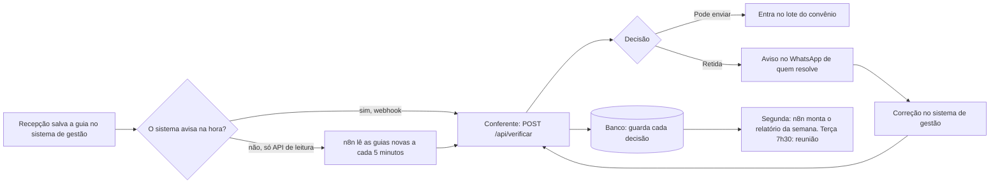

# Vitalis · conferência de guias de convênio antes do envio

Etapa técnica do processo da Expert Integrado. Caso fictício da Clínica Vitalis: a recepção lança cerca de 900 guias por mês, o financeiro confere no fim do mês e o erro só aparece quando o convênio glosa, 60 dias depois. Aqui a conferência acontece no lançamento, antes do envio, e o Dr. Renato vê o resultado toda terça.

- **No ar:** https://vitalis-guias.vercel.app
- **Resultado no lote de agosto:** 80 guias conferidas, 43 podem ir, 37 retidas, R$ 2.712,00 em risco de R$ 5.694,00.

## O que tem aqui

| Pasta | O que é |
|---|---|
| `motor/` | O motor de regras, em Python puro, sem dependência. É ele que decide. |
| `dados/` | `guias.csv` e `regras_convenio.json` da prova, sem alteração, mais `regras_extras.json` (ver decisão 3). |
| `api/` e `web/` | A API publicada na Vercel. `web/rotas.py` tem a lógica; `api/*.py` só recebe o pedido. |
| `public/index.html` | A página. Quatro abas de apresentação (1. O que foi construído, 2. Dados e problemas, 3. Soluções, 4. Entregáveis) e o sistema: visão geral com os gráficos de decisão, as guias de agosto, o formulário de lançamento, o relatório de terça (texto e imagem para o WhatsApp) e, em Como funciona, as regras agrupadas pela decisão que dão e a regra de cada convênio. |
| `mcp_server/` | O MCP, com quatro ferramentas. |
| `skills/conferir-guia/` | A Skill para quem opera a clínica. |
| `tests/` | 85 testes do motor. |

## Como uma guia entra e como a decisão sai

1. **Entra** por um de três caminhos, todos no mesmo motor:
   - `POST /api/verificar` com os campos da guia. O caso diz que o sistema de gestão tem API e exporta relatórios: em produção, um fluxo no n8n lê as guias novas nessa API a cada poucos minutos e manda cada uma para cá (se o sistema tiver webhook, ele chama direto). É isso que faz a conferência não depender de alguém lembrar;
   - a página, num formulário que faz o papel da tela de lançamento do sistema de gestão. A guia é conferida enquanto a pessoa preenche (sem IA, para ser rápido) e de novo ao lançar. Dá para colar o que a recepção escreveu: linha do sistema, "campo: valor" ou texto corrido. O texto só preenche o formulário, e a pessoa confere os campos antes de lançar;
   - o MCP, pela Skill, dentro do Claude.
2. O motor **lê** a guia como ela veio: data em dia/mês/ano, valor com vírgula, convênio sem acento. "Aguardando", "-" e "N/A" contam como campo vazio. Número que não é claramente um número ("1 1", "11 ou 12") não é adivinhado: a guia fica retida.
3. A **observação da recepção vira fatos** (quer particular, autorização por telefone, código errado), por palavras-chave, trecho a trecho. Um trecho só é dado como entendido se for exatamente uma frase comum ("chegou 10 min atrasado") ou se virar um fato, e todo fato vira pendência. O que sobrar segura a guia para uma pessoa ler. Com chave de IA, o modelo lê a observação e pode acrescentar fatos que geram pendência. Ele nunca consegue liberar uma guia.
4. As **regras decidem**: campo obrigatório por convênio, paciente, sessão e valor preenchidos, validade da autorização contra a data do atendimento, limite de sessões, cobertura do procedimento, registro do profissional, prazo de envio contado do atendimento e duplicidade dentro do lote (mesma guia repetida, ou mesma autorização com o mesmo número de sessão).
5. **Sai** a decisão, com o motivo e o que fazer:
   - **Pode enviar** (`ok`): cumpre todas as regras do convênio;
   - **Não enviar assim** (`nao_enviar`): se for enviada, o convênio recusa. Precisa de autorização nova, ou a guia não deve ir para este convênio;
   - **Corrigir antes de enviar** (`corrigir`): falta um dado ou ele está errado, e dá para arrumar a guia;
   - **Conferir antes de enviar** (`conferir`): a regra escrita não proíbe, mas tem algo estranho. Alguém confirma antes.

   Guia retida sai também com o **aviso pronto**: para quem vai (recepção da unidade, quem pede autorização, financeiro ou a Carla) e o texto, sem nome de paciente nem CID. Em produção o n8n só entrega no WhatsApp.

   Cada guia retida também sai com o **próximo passo**, que diz quem resolve: resolver com o convênio, a recepção completa ou corrige a guia, cobrar do paciente como particular, decidir com o financeiro, confirmar antes de enviar ou descartar a cópia. É o que a visão geral e o relatório de terça usam para dividir o valor retido.

```bash
curl -X POST https://vitalis-guias.vercel.app/api/verificar \
  -H "Content-Type: application/json" \
  -d '{"guia": {"id_guia": "G-2609-0001", "unidade": "Sul", "paciente": "P-1001", "convenio": "Vitalcard", "procedimento_codigo": "50000470", "data_atendimento": "2026-09-02",
       "numero_autorizacao": "AUT1", "autorizacao_validade": "2026-09-20", "sessao_numero_na_autorizacao": "11",
       "carteirinha": "111222333", "cid": "M54.5", "profissional_registro": "CREFITO-3 204411-F", "valor": "62.00"}}'
```

Esse exemplo volta "Não enviar assim" de propósito: é a sessão 11 de uma autorização do Vitalcard, que cobre 10.

## O MCP

Fica em `mcp_server/server.py`. Lê `dados/regras_convenio.json` e `dados/guias.csv` direto do disco e usa o mesmo motor da página.

| Ferramenta | O que faz |
|---|---|
| `consultar_regra(convenio, procedimento)` | Se o convênio cobre o procedimento, valor de referência, campos obrigatórios, limite de sessões, prazo de envio. |
| `verificar_guia(id_guia ou os campos)` | Confere uma guia do lote ou uma guia nova. Devolve decisão, motivo e o que corrigir. |
| `listar_pendentes(convenio, unidade)` | As guias do lote que não podem ser enviadas ainda. |
| `relatorio_de_terca(semana)` | O resumo do Dr. Renato. Com `semana` (`ultima` ou uma data, como 2026-08-24), só as guias lançadas de segunda a domingo daquela semana; vazio, o lote inteiro. |

Instalar. O SDK de MCP pede Python 3.10 ou mais novo. No macOS o `python3` do sistema costuma ser 3.9: confira com `python3 --version` e, se for o caso, use `python3.13` (ou outro que você tenha) na linha do venv.

```bash
git clone https://github.com/gbfelipe7/vitalis-guias.git
cd vitalis-guias
python3 -m venv .venv            # com Python 3.10 ou mais novo
.venv/bin/pip install -r mcp_server/requirements.txt
.venv/bin/python mcp_server/conferir_servidor.py     # sobe o servidor e chama as ferramentas, para ver funcionando
```

Ligar no Claude Code:

```bash
claude mcp add vitalis-guias -- "$(pwd)/.venv/bin/python" "$(pwd)/mcp_server/server.py"
```

No Claude Desktop, em `claude_desktop_config.json`:

```json
{ "mcpServers": { "vitalis-guias": {
    "command": "/caminho/para/vitalis-guias/.venv/bin/python",
    "args": ["/caminho/para/vitalis-guias/mcp_server/server.py"] } } }
```

## A Skill

Fica em `skills/conferir-guia/SKILL.md`. Para usar, copie a pasta `conferir-guia` para `~/.claude/skills/` (ou para `.claude/skills/` do projeto) com o MCP ligado. A pessoa cola a guia do jeito que a recepção escreveu. A Skill separa os campos, chama `verificar_guia` e responde a decisão (Pode enviar, Não enviar assim, Corrigir antes de enviar ou Conferir antes de enviar), o motivo, o que fazer e quem resolve. Ela não decide nada sozinha.

## Rodar na sua máquina

```bash
python3 servidor_local.py      # página e API em http://localhost:8000, sem instalar nada
python3 -m unittest            # os 85 testes do motor
```

A chave de IA é opcional. Sem ela tudo funciona: a observação é lida por palavras-chave e o texto corrido por expressão regular. Com `GEMINI_API_KEY` no ambiente (veja `.env.example`), o que eles não alcançam é lido pelo Gemini no nível gratuito. Na Vercel a chave fica nas variáveis de ambiente do projeto. Não existe chave nem senha neste repositório.

## Como fica em produção

Na prova, a guia entra pela página, pela API ou pelo Claude. Na clínica, a recepção continua no sistema de gestão dela, e a conferência entra por trás, sem ninguém precisar lembrar.



1. A recepção lança a guia no sistema de gestão, como já faz.
2. Se o sistema avisa quando uma guia é salva (webhook), ele chama o conferente na hora. Se só permite ler os dados pela API, que é o que o caso garante, o n8n lê as guias novas a cada poucos minutos e manda cada uma para o conferente.
3. O conferente decide em menos de um segundo e grava a decisão no banco.
4. Guia que pode ir entra no lote do convênio. Guia retida gera o aviso no WhatsApp de quem resolve (recepção da unidade, quem pede autorização, financeiro ou a Carla), sem nome de paciente nem CID. Se a API permitir, o status também volta para o sistema.
5. Corrigida no sistema, a guia passa de novo pela conferência e entra no lugar da anterior.
6. Toda segunda, o n8n monta o relatório da semana anterior (as guias lançadas de segunda a domingo) a partir do banco, para a análise. Na terça, às 7h30, a imagem e o texto vão para a reunião do Dr. Renato. Na página, a aba Relatório de terça abre na última semana completa do lote (24/08 a 30/08) e deixa escolher outra semana ou agosto inteiro; na API, `GET /api/relatorio?semana=2026-08-24`.

Alguns minutos entre salvar e conferir não atrapalham: o envio ao convênio é feito em lote, depois. O que importa é que nenhuma guia sai sem conferência.

| Peça | Na prova | Em produção |
|---|---|---|
| Onde roda | Vercel, grátis | VPS no Brasil, em containers: conferente, banco, n8n e Nginx |
| Entrada da guia | Página, API e Claude | Webhook do sistema de gestão ou n8n lendo a API dele |
| Histórico | Só na aba do navegador | Postgres, com cada conferência e quando foi resolvida |
| Proteção da API | Aberta, para a banca testar | Token do sistema de gestão, HTTPS pelo Nginx |
| Aviso de guia retida | Simulado na tela | WhatsApp num número da clínica: pela API oficial da Meta, ou por Z-API ou Evolution API. Para dado de saúde eu prefiro a oficial, que é da Meta e não arrisca o bloqueio do número; Z-API e Evolution são mais rápidas de ligar |
| Relatório de terça | Copiado na página | Agendado no n8n |
| IA | Gemini no nível gratuito | Um modelo pequeno e barato no plano pago, como um GPT mini ou o Gemini Flash, que não usam o conteúdo da API para treinar. Ela só lê texto, então um modelo pequeno basta |
| MCP e Skill | O MCP roda na máquina de quem usa o Claude | O MCP roda na VPS e o Claude da recepção se conecta por um endereço, sem instalar nada |

O código do conferente é o mesmo nos dois. Muda onde ele roda e o que fica em volta dele.

## Como fiz

### Ferramentas e por quê

- **Python puro no motor.** Regra de convênio é comparação de data, número e lista. Não precisa de biblioteca, roda igual na Vercel, no MCP e na minha máquina, e qualquer pessoa lê.
- **Vercel** para publicar: grátis, aceita função em Python e eu já uso.
- **SDK oficial de MCP em Python**, porque o MCP reaproveita o motor sem reescrever nada.
- **Gemini no nível gratuito** só para ler texto livre. Custo zero.
- **Claude Code** para escrever o código comigo.

### O que a IA gerou e o que foi decisão minha

O código foi escrito com o Claude Code, e agentes de IA testaram o resultado. As decisões abaixo são minhas: umas eu trouxe desde o começo, outras surgiram durante a construção e eu revisei e mantive. Sei defender cada uma.

O princípio que guiou tudo: resolver em código o máximo que der, com regra escrita, e usar a IA só onde ela é necessária de verdade.

Depois de ver a primeira versão, pedi para refazer quatro coisas: a entrada da guia nova virou um formulário igual à tela do sistema de gestão; os nomes das decisões passaram a dizer o que fazer (Pode enviar, Não enviar assim, Corrigir antes de enviar, Conferir antes de enviar), com quem resolve cada guia; as regras passaram a aparecer agrupadas pela decisão que dão, cada uma levando a uma decisão só; e metade do texto da página saiu. Também pedi o aviso no WhatsApp de quem resolve e o cartão que mostra que, quanto mais tarde a guia é lançada, mais ela fica retida.

1. **Regra decide, IA só lê texto.** Conferir guia é comparar data, limite e cobertura: tem resposta certa e ela precisa ser a mesma toda vez. Então a decisão é um motor de regras, sem IA. A IA entra só para ler texto livre, em dois pontos: separar os campos de uma guia colada em texto corrido e ler a observação da recepção. As travas que eu coloquei: na observação a IA só pode endurecer (acrescenta fato que gera pendência, e não consegue apagar o "texto que ninguém entendeu" nem devolver fato que amolece a decisão); no texto corrido todo valor que a IA devolve tem que existir no texto colado, senão é descartado, e a pessoa confirma os campos antes de a guia ser conferida; e o lote de agosto roda sem IA, para dar sempre o mesmo resultado.
2. **Na dúvida, segura.** Segurar uma guia boa custa um dia. Enviar uma ruim custa 60 dias e o valor da guia. Por isso existe o nível `conferir`: reavaliação de fisioterapia lançada por médico no Plano Bem, mesmo paciente (mesma carteirinha) com o mesmo procedimento no mesmo dia em outra guia, sessão remarcada com autorização da data original. A regra escrita não proíbe, mas eu não enviaria sem alguém olhar. O relatório separa isso do que é glosa certa, para o Dr. Renato não achar que tudo é perdido.
3. **As frases dos convênios viraram regra escrita.** O `regras_convenio.json` traz parte das regras em texto livre ("aceita autorização verbal com protocolo por até 5 dias úteis"). Em vez de pedir para uma IA interpretar isso a cada guia, a frase foi lida uma vez e virou regra em `dados/regras_extras.json`, citando a frase de origem. É o princípio de resolver em código o que dá. O arquivo da Carla fica intacto.
4. **A guia é conferida no lançamento, pela API.** A página faz o papel da tela do sistema de gestão e serve para a demonstração. O endereço de API é o que resolve o problema de verdade: em produção, o n8n lê as guias novas na API do sistema a cada poucos minutos e manda cada uma para a conferência, e ninguém precisa lembrar de conferir.
5. **Guia repetida: a cópia é a lançada depois.** Duas guias do lote são a mesma, mas uma tem a data como 26/08/2026 e a outra como 2026-08-26. Comparando texto, passa. Por isso a guia é arrumada antes de qualquer comparação. Quando tudo bate (paciente, dia, procedimento, autorização e sessão), é o mesmo atendimento lançado duas vezes: a primeira vai e a lançada depois não deve ir. Quando só parte bate, as duas ficam para alguém conferir. Só o código do paciente igual não basta: nesta base ele se repete entre pessoas diferentes.
6. **Dinheiro em risco é o valor da guia pendente, contado uma vez.** Guia com dois problemas entra no tipo do problema mais grave. Assim a soma por tipo bate com o total e ninguém conta o mesmo dinheiro duas vezes.

7. **O lote é conferido na data de lançamento; a guia nova, hoje.** O recrutador orientou simular a conferência do lote de agosto na data de lançamento, como se a guia tivesse acabado de ser lançada. Por isso nenhuma das 80 aparece com prazo de envio vencido. Já a guia que chega pela página, pela API ou pelo MCP é conferida com a data de hoje: uma guia de junho lançada agora sai com o prazo vencido.

### O que ficou de fora e por quê

- **Validade máxima da autorização** (30, 45 e 60 dias): o CSV só tem a data final, não a de concessão. Não dá para conferir sem inventar dado. A ferramenta `consultar_regra` mostra o número. O motor usa esse número só como aviso, nunca como pendência: quando a validade (lançada ou anotada pela recepção) passa do máximo do convênio contado do atendimento, por exemplo na G-2608-0030.
- **Banco de dados.** As guias novas conferidas na página ficam só na sessão do navegador. Em produção eu gravaria cada conferência no Postgres, e o relatório de terça sairia de lá com histórico semana a semana.
- **Feriados** na conta de dias úteis da autorização verbal. A prova não traz calendário.
- **Proteção do endereço da API.** Está aberto, porque a banca precisa testar sem senha. Em produção ele ficaria atrás de um token do sistema de gestão. Na prova o custo de IA é zero, porque a chave é do nível gratuito, e o texto mandado ao modelo é cortado em 2.000 caracteres.
- **LGPD e dado de saúde.** Na prova os dados são fictícios, por isso usei o Gemini no nível gratuito. Com paciente real ele não serve: os termos do nível gratuito pedem para não mandar dado pessoal e permitem que o conteúdo seja usado e revisado. Em produção seria um modelo pequeno no plano pago, como um GPT mini ou o Gemini Flash, que não usam o conteúdo da API para treinar, com contrato de operador de dados com a clínica. O lote e o MCP já funcionam sem IA, e o aviso de WhatsApp sai sem nome de paciente e sem CID.
- **Envio automático do relatório de terça.** O endereço `GET /api/relatorio` está pronto; o agendamento no n8n (toda terça às 7h30, para o WhatsApp do Dr. Renato) não foi montado para a prova.
- **Recibo para reembolso.** Oito guias têm a observação "Pediu recibo para reembolso do plano". Pode ser sinal de que o paciente pagou particular, e aí faturar o convênio seria cobrança em dobro. Os dados não confirmam, então o motor avisa e não segura. É pergunta para a Carla.
- **Ligação real com o sistema de gestão.** O endereço está pronto; ler as guias novas e devolver a decisão ao sistema depende da API da clínica. Hoje a conferência informa, mas não impede o envio: em produção, o lote do convênio sairia só com as guias que podem ir.
- **CID combinando com o procedimento.** O motor não confere se o CID faz sentido para o procedimento, porque isso não está nas regras dos convênios. Seria um alerta, não um motivo para segurar a guia.
- **Histórico de autorizações.** As 80 guias são o recorte de agosto, então o motor confere o que a guia declara e não tenta reconstruir a sequência de sessões de cada autorização.

### Quanto tempo levou

Cerca de 5 horas de trabalho meu, espalhadas entre 21 e 24/09, dentro do teto sugerido pela prova. O Claude Code gerou e testou o código nesse tempo.

### Próximos passos

1. **Conferir antes da sessão.** Nenhuma guia de agosto foi lançada antes do atendimento, e 22 das 37 retidas (R$ 1.672) tinham um problema que dava para ver antes da sessão: 17 com a autorização vencida ou esgotada e 5 com procedimento que o convênio não cobre. Conferida depois, a guia fica retida, mas a sessão já aconteceu. A tabela de motivos de glosa da ANS (Tabela 38 da TUSS) tem código próprio para autorização com data posterior ao atendimento (1814 e 1825) e para procedimento feito antes da autorização (1840). Por isso a conferência vem para antes, em três momentos:
   - **ao marcar**, a consulta de regra diz se o convênio cobre;
   - **na semana**, a lista mostra quem vai ficar sem autorização (hoje, 18) e a recepção pede antes;
   - **na chegada**, a última rede: a guia abre com o paciente no balcão e é conferida de novo depois da sessão.

   Não prometo valor salvo. A mudança troca uma glosa descoberta 60 dias depois por uma decisão tomada antes da sessão. Falta combinar com a Carla e testar por 4 semanas numa unidade.
2. **Avisar na hora quem resolve.** A mensagem e o destinatário já saem prontos, sem nome de paciente nem CID. Falta ligar o envio no WhatsApp, pela API oficial da Meta, Z-API ou Evolution.
3. **Provar o resultado.** O relatório de terça mede a semana. Ler o retorno do convênio, casando cada glosa do demonstrativo com a guia, mostra se a glosa caiu, e o que o conferente deixou passar vira regra nova. Do mesmo retorno sai o texto do recurso de glosa, com o prazo controlado.

### Os prompts

Os dois lugares em que a IA entra têm o prompt no próprio código:
- `motor/entrada.py`, função `_de_ia`: separa os campos de uma guia colada em texto corrido.
- `motor/observacao.py`, função `_por_ia`: lê a observação da recepção e só pode acrescentar motivo para segurar.

Os dois vão ao Gemini por `motor/ia.py`, com resposta em JSON. A Skill (`skills/conferir-guia/SKILL.md`) é o prompt do Claude para quem opera a clínica.

### Como testei

- 85 testes automáticos em `tests/test_motor.py`. Os grupos: as guias do lote que têm pegadinha, uma a uma; guias novas chegando tortas (vazia, com lixo nos campos, data em outro formato, convênio que não existe, repetida do lote); e um teste para cada furo que as duas rodadas de auditoria abaixo encontraram.
- **Auditoria cega.** Pedi para cinco agentes de IA julgarem as 80 guias só com o CSV e as regras, sem ver o meu motor, e comparei. Deu 15 divergências em 80. Em nenhuma o motor tinha decidido errado: 12 eram diferença de vocabulário e 3 eram julgamento, como o recibo para reembolso.
- **Ataque à guia nova, em duas rodadas.** Outros agentes tentaram fazer uma guia errada sair como OK: campo com lista, `NaN`, sessão "11ª", data 31/02, observação com instrução escondida para a IA, texto corrido com uma "correção" embutida. A primeira rodada achou furos reais: guia repetida sem data de lançamento passava, uma frase comum escondia o resto da observação, sessão ilegível pulava a checagem de limite e a IA conseguia liberar uma guia ficando calada. Corrigi e mandei atacar de novo. A segunda rodada mostrou que a minha primeira correção era frouxa: bastava o trecho CONTER "atrasado" para ser ignorado, e a IA ainda conseguia amolecer uma decisão. Daí saíram as regras de hoje: o trecho tem que SER a frase comum, todo fato vira pendência, a IA só endurece e texto corrido passa por confirmação.
- **Terceira rodada, depois da página nova.** Agentes testaram a página no navegador (computador e celular, tema claro e escuro), conferiram cada número e cada frase contra o motor e revisaram as mudanças do motor, com um cético tentando derrubar cada achado. Sobraram 36 problemas reais, a maioria pequena. Os maiores: a mesma guia lançada duas vezes na sessão saía "Pode enviar" nas duas, e duas barras da visão geral abriam mais guias do que mostravam. Todos corrigidos, com teste.
- `mcp_server/conferir_servidor.py` sobe o MCP de verdade e chama as quatro ferramentas como um cliente faria.
- A página e os quatro endereços testados no ar, com guia certa, guia com problema, texto corrido e corpo inválido.
- As cinco guias que só se entendem pela observação da recepção foram conferidas uma a uma: G-2608-0030, 0034, 0039, 0041 e 0069.
